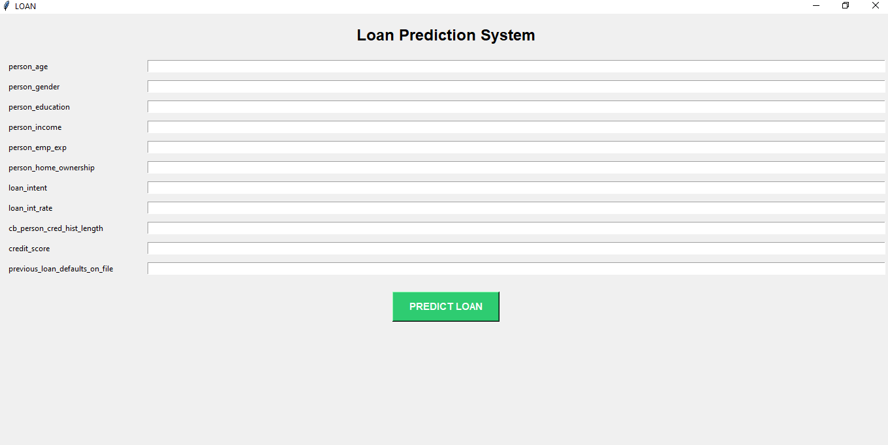
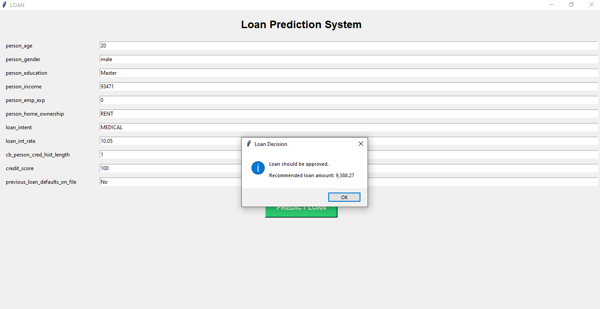
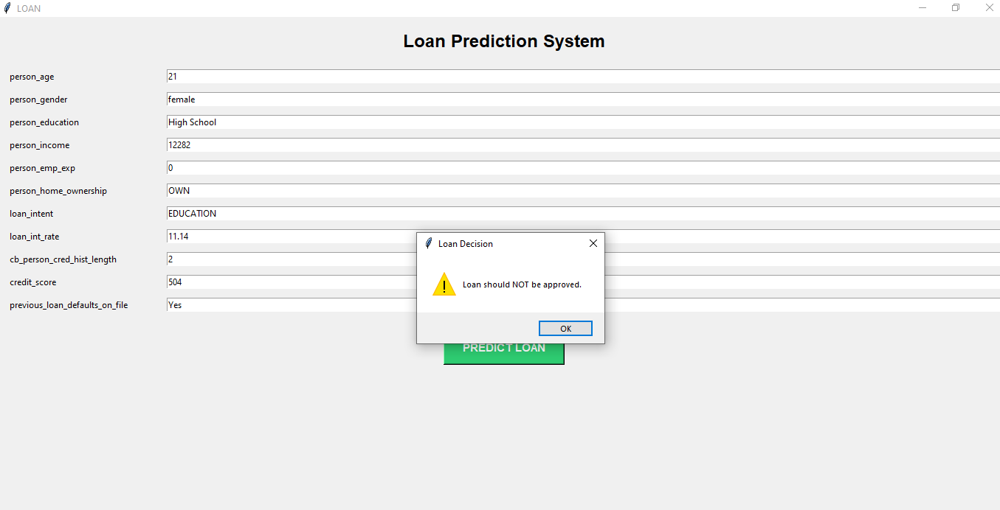

[Uploading README.md…]()
# Loan Approval Prediction — Classification + Regression

## Project Overview

This project is a machine learning application that combines **classification** and **regression** to make a two-step loan prediction.

The application receives information about an applicant and:
1. Predicts whether the applicant's loan should be approved or rejected.
2. If the loan is approved, predicts a recommended loan amount.

This project is designed for educational purposes and demonstrates how two supervised learning tasks can work together in one application.

## Project Goal

The goal is to build a system that can use applicant information to answer two questions:

- **Classification:** Can the applicant receive a loan?
- **Regression:** If the loan is approved, approximately how much can be recommended?

## Dataset

The model was trained using a prepared dataset from Kaggle:

**Loan Approval Classification Dataset — Kaggle**

https://www.kaggle.com/datasets/taweilo/loan-approval-classification-data?utm_source=chatgpt.com

The dataset contains applicant and loan-related information suitable for supervised machine learning.

> **Note:** This dataset is used for educational and experimental purposes. A model prediction should not be treated as an actual financial decision.

## How the Model Works

The project uses two machine learning models.

### 1. Classification Model

**Model:** Logistic Regression

The classification model predicts the loan approval status.

**Output:**
- Loan approved
- Loan not approved

### 2. Regression Model

If the classification model predicts approval, the regression model predicts the loan amount.

**Model:** Linear Regression

**Output:**
- Predicted / recommended loan amount

### Overall Workflow

```text
Applicant Information
        |
        v
Data Preprocessing
        |
        v
Classification Model
        |
   +----+----+
   |         |
Reject     Approve
   |         |
   v         v
Show      Regression Model
"Loan       |
not         v
approved"  Predicted Loan Amount
```

## Training Process

### Step 1 — Load the Dataset

The dataset is loaded using Pandas.

### Step 2 — Prepare the Data

Categorical values such as gender, home ownership, loan intent, education, and previous defaults are converted into numerical representations so that machine learning algorithms can process them.

### Step 3 — Select Features

The model uses applicant information such as:

- Age
- Gender
- Education
- Income
- Employment experience
- Home ownership
- Loan intent
- Interest rate
- Credit history length
- Credit score
- Previous loan defaults

### Step 4 — Train the Classification Model

```python
from sklearn.linear_model import LogisticRegression

model_class = LogisticRegression(max_iter=1000)
model_class.fit(X_class, y_class)
```

### Step 5 — Train the Regression Model

```python
from sklearn.linear_model import LinearRegression

model_reg = LinearRegression()
model_reg.fit(X_reg, y_reg)
```

### Step 6 — Make a Prediction

When the user enters information, the same preprocessing is applied to the new data. The classification model runs first. If approval is predicted, the regression model predicts the recommended loan amount.

## Input Information

| Input | Description |
|---|---|
| **Person Age** | Applicant's age |
| **Person Gender** | Applicant's gender |
| **Person Education** | Education level |
| **Person Income** | Applicant's income |
| **Person Employment Experience** | Years of employment experience |
| **Person Home Ownership** | Type of home ownership |
| **Loan Intent** | Reason for requesting the loan |
| **Loan Interest Rate** | Loan interest rate |
| **Credit History Length** | Length of the applicant's credit history |
| **Credit Score** | Applicant's credit score |
| **Previous Loan Defaults** | Whether the applicant has previous loan defaults |

### Example Input

```text
Age: 30
Gender: Male
Education: Bachelor
Income: 60000
Employment Experience: 5
Home Ownership: Rent
Loan Intent: Education
Interest Rate: 10.5
Credit History Length: 6
Credit Score: 700
Previous Loan Defaults: No
```

The user does not directly enter the final prediction. The application calculates the loan decision and, when approved, the recommended amount.

## Application Screenshots

### 1. Application Interface



### 2. Approved Loan — Recommended Amount



### 3. Loan Not Approved



## How to Use the Application

### 1. Install Python

Make sure Python is installed on your computer.

### 2. Install the Required Libraries

```bash
pip install pandas numpy scikit-learn
```

> Tkinter is normally included with standard Python installations on Windows.

### 3. Prepare the Dataset

Place the training CSV file in the project directory, for example:

```text
data_train.csv
```

### 4. Run the Application

```bash
python loan.py
```

The graphical user interface will open.

### 5. Enter Applicant Information

Fill in the required fields, including income, education, employment experience, credit score, and other applicant information.

### 6. Get the Prediction

Click the prediction button. The application will process the information, predict the loan approval status, and, if approved, predict the recommended loan amount.

## Technologies Used

- **Python**
- **Pandas** — data loading and preprocessing
- **NumPy** — numerical operations
- **Scikit-learn** — machine learning models
- **Tkinter** — graphical user interface
- **Jupyter Notebook** — model development and experimentation
- **Kaggle Dataset** — training data source

## Project Structure

```text
Loan-Prediction/
│
├── data_train.csv
├── loan.py
├── loan_model.ipynb
├── README.md
├── README_FA.md
│
└── images/
    ├── application.png
    ├── approved_result.png
    └── not_approved_result.png
```

Replace filenames with your actual filenames if they are different.

## Why Use Both Classification and Regression?

Classification can answer:

> "Will the loan be approved?"

But it cannot directly answer:

> "How much should be recommended?"

Combining both models creates a two-stage prediction system:

```text
Classification
      ↓
Approved?
   ↙     ↘
 No       Yes
 ↓         ↓
Reject   Regression
           ↓
    Loan Amount
```

## Limitations

This project is intended for learning and demonstration.

Predictions can be affected by:
- Training-data quality and distribution
- Selected features
- Preprocessing
- Machine learning algorithms
- Information not represented in the training data

The predicted amount is a model output, not a guaranteed loan offer or financial recommendation.

## Future Improvements

Possible improvements include:

- Comparing Logistic Regression with other classification algorithms
- Comparing Linear Regression with other regression models
- Adding model evaluation metrics
- Adding a confusion matrix and regression error charts
- Saving trained models with `joblib`
- Loading saved models instead of training every time
- Improving the graphical interface
- Adding input validation
- Adding prediction history
- Feature engineering and hyperparameter tuning

## Conclusion

This project demonstrates a practical example of combining **classification and regression** in one machine learning application.

The classification model predicts whether a loan is approved, while the regression model estimates the loan amount when approval is predicted.

The complete workflow is:

**Dataset → Preprocessing → Training → Prediction → GUI Result**
